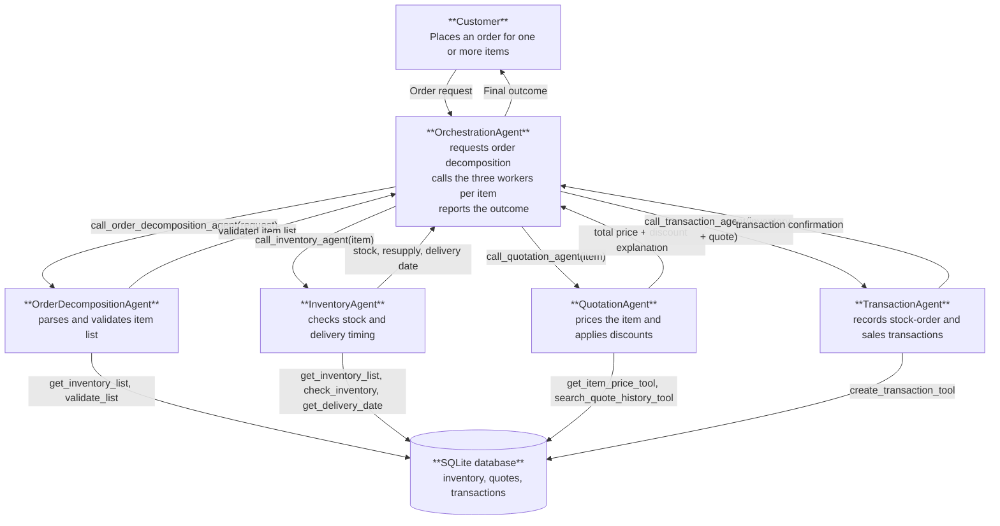

# Munder Difflin Multi-Agent Workflow

This design uses five `smolagents` `ToolCallingAgent`s, implemented in `munder_difflin.py` (Orchestrator + 4 workers, at the project's agent limit):

- **OrchestrationAgent:** owns the customer conversation, asks OrderDecompositionAgent to split the order into items, delegates each item to the three remaining workers, and reports the outcome. It calls workers directly (`self.inventory_agent.run(...)`, etc.) rather than making inventory, pricing, or transaction decisions itself.
- **OrderDecompositionAgent:** parses the raw customer order into a validated list of `{item_name, quantity, request_date, fulfillment_date}` records. It does not check stock, price, or create transactions.
- **InventoryAgent:** looks up the inventory list, checks stock and resupply needs for one item, and estimates the delivery date. It does not calculate customer prices or write transactions.
- **QuotationAgent:** looks up the item price and quote history, and calculates the total price including bulk discounts. It does not check stock or write transactions.
- **TransactionAgent:** records the stock-order and sales transactions for an item once inventory and quotation results are available. It is the only worker that changes transaction state.

## Architecture and Data Flow

## Tools

| Agent | Agent tool | Purpose | Underlying helper function(s) |
| --- | --- | --- | --- |
| OrderDecompositionAgent | `get_inventory_list` | List all items with positive stock, used to match requested items to exact catalogue names. | `get_all_inventory(as_of_date)` |
| OrderDecompositionAgent | `validate_list` | Check each decomposed item has `item_name`, `quantity`, `request_date`, `fulfillment_date` and a known item name. | `get_item_price(item_name)` |
| InventoryAgent | `get_inventory_list` | List all items with positive stock on the request date. | `get_all_inventory(as_of_date)` |
| InventoryAgent | `check_inventory` | Check one item's stock against the requested quantity and compute the resupply amount. | `get_stock_level(item_name, as_of_date)` |
| InventoryAgent | `get_delivery_date` | Estimate the supplier delivery date for a resupply quantity. | `get_supplier_delivery_date(input_date_str, quantity)` |
| QuotationAgent | `get_item_price_tool` | Look up the catalogue unit price for an item. | `get_item_price(item_name)` |
| QuotationAgent | `search_quote_history_tool` | Find comparable historical quotes to justify pricing/discounts. | `search_quote_history(search_terms)` |
| TransactionAgent | `create_transaction_tool` | Record a `stock_orders` or `sales` transaction, checking cash balance before a resupply purchase. | `create_transaction(item_name, transaction_type, quantity, price, date)` and `get_cash_balance(as_of_date)` |
| OrchestrationAgent | `call_order_decomposition_agent` | Delegate order parsing to OrderDecompositionAgent and return the validated item list. | Wraps `OrderDecompositionAgent.run(...)` |
| OrchestrationAgent | `call_inventory_agent` | Delegate one item to InventoryAgent and return its result. | Wraps `InventoryAgent.run(...)` |
| OrchestrationAgent | `call_quotation_agent` | Delegate one item to QuotationAgent and return its result. | Wraps `QuotationAgent.run(...)` |
| OrchestrationAgent | `call_transaction_agent` | Delegate the combined inventory + quote result to TransactionAgent. | Wraps `TransactionAgent.run(...)` |
| Reporting used in `run()` | — | Reports cash balance and inventory value before/after each request. | `generate_financial_report(as_of_date)` |

All messages passed between agents are text containing the request, exact item names, quantities, dates, and the previous agent's result. The orchestrator first decomposes the order into items via OrderDecompositionAgent, then processes the order **one item at a time**, completing inventory, quotation, and transaction steps for an item before moving to the next.

## Reflection

The system still has issues with serializing orders. A major (intended) source of errors is that the customer is ordering item that don't exist or are paraphrased. This is unrealistic as no company uses e-mail to finalize an order but rather a shop-like system.

The multiagent workflow could work work much better if such a system would be implemented. Instead of using item names, the entire ordering system should be remodelled to orders using item ids.

The process of decomposing an order into several smaller ones is task I would have liked to be handled by the orchestrator. But it showed weaknesses when ask to loop its steps. Looping in general should be done in python.

## Areas for improving
- Improve Order input:
    - Construct an agentic workflow that prepares the orders for efficient handling by
    - Filter order for missing items. Decide if parts of the order could and should be fulfilled
    - Replace item names with item ids that match the database
    - Input the orders into the database

- Rework some of the tools:
    - Some tools had to be used due to the project rubics. The originally proposed toolset (that had to be revised and is now missing) would have fitted much better
    - e.g. get_cash_balance -> should be replaced with a better transaction table, that includes a running balance.
    - e.g. get_supplier_delivery_date -> doesn't make sense, as the company was described as paper production company, not a reseller -> replace with production logic
    - e.g. get_stock_level -> traverses all transaction just to calculate the stock -> create inventory table that simply displays the stock

- Transactional flow
    - Let each agent prepare part of the transaction (e.g. inventory -> reserves stock, prepares production schedule)
    - Design a validation agent that checks all prepared transaction
    - Trigger a commit if validation is successful

- Handling of dates is a mess
    - helper functions require a date (they should not)