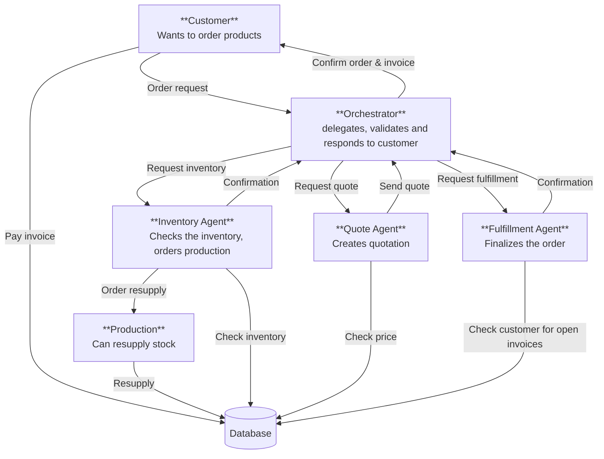

# Munder Difflin Multi-Agent Workflow

This design uses four agents:

- **Orchestrator agent:** owns the customer conversation, extracts the requested items and dates, delegates work, validates worker results, and returns one text response. It does not make inventory, pricing, or transaction decisions itself.
- **Inventory agent:** determines stock availability and identifies replenishment needs. It does not calculate customer prices or finalize sales.
- **Quote agent:** uses the request and quote history to calculate a quote, including a bulk discount and an explanation. It does not reserve stock or write transactions.
- **Fulfillment agent:** checks whether the quoted order can be delivered and records the sale and any required stock order. It is the only worker that changes transaction state.

## Architecture and Data Flow

## Orchestration Sequence

## Tool Responsibilities

| Agent tool | Purpose | Starter helper function(s) |
| --- | --- | --- |
| `check_inventory` | Check whether the requested products are in stock. | `get_all_inventory(as_of_date)` or `get_stock_level(item_name, as_of_date)` |
| `order_resupply` | Request replenishment from Production when inventory is insufficient. | `get_supplier_delivery_date(input_date_str, quantity)` and `create_transaction(item_name, "stock_orders", quantity, price, date)` |
| `check_price` | Look up product prices when preparing a quotation. | `generate_financial_report(as_of_date)` for inventory unit prices |
| `pay_invoice` | Record the customer payment when the order is confirmed. | `create_transaction(item_name, "sales", quantity, price, date)` |
| `check_open_invoices` | Check the customer's outstanding invoice status before fulfillment. | No dedicated helper exists in the starter code; this requires customer invoice data to be added to the database. |

All messages passed between agents are text containing the request, exact item names, quantities, dates, and the previous agent's result.