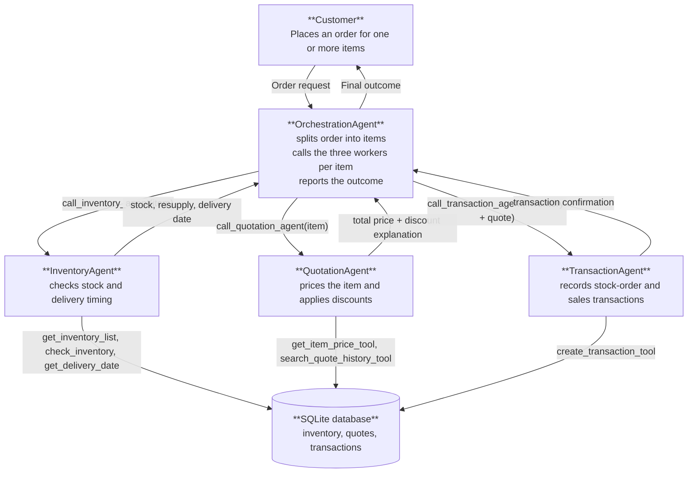

# Munder Difflin Multi-Agent Workflow

This design uses four `smolagents` `ToolCallingAgent`s, implemented in `munder_difflin.py`:

- **OrchestrationAgent:** owns the customer conversation, breaks the order into items, delegates each item to the three worker agents in sequence, and reports the outcome. It calls workers directly (`self.inventory_agent.run(...)`, etc.) rather than making inventory, pricing, or transaction decisions itself.
- **InventoryAgent:** looks up the inventory list, checks stock and resupply needs for one item, and estimates the delivery date. It does not calculate customer prices or write transactions.
- **QuotationAgent:** looks up the item price and quote history, and calculates the total price including bulk discounts. It does not check stock or write transactions.
- **TransactionAgent:** records the stock-order and sales transactions for an item once inventory and quotation results are available. It is the only worker that changes transaction state.

## Architecture and Data Flow

## Tools

| Agent | Agent tool | Purpose | Underlying helper function(s) |
| --- | --- | --- | --- |
| InventoryAgent | `get_inventory_list` | List all items with positive stock on the request date. | `get_all_inventory(as_of_date)` |
| InventoryAgent | `check_inventory` | Check one item's stock against the requested quantity and compute the resupply amount. | `get_stock_level(item_name, as_of_date)` |
| InventoryAgent | `get_delivery_date` | Estimate the supplier delivery date for a resupply quantity. | `get_supplier_delivery_date(input_date_str, quantity)` |
| QuotationAgent | `get_item_price_tool` | Look up the catalogue unit price for an item. | `get_item_price(item_name)` |
| QuotationAgent | `search_quote_history_tool` | Find comparable historical quotes to justify pricing/discounts. | `search_quote_history(search_terms)` |
| TransactionAgent | `create_transaction_tool` | Record a `stock_orders` or `sales` transaction, checking cash balance before a resupply purchase. | `create_transaction(item_name, transaction_type, quantity, price, date)` and `get_cash_balance(as_of_date)` |
| OrchestrationAgent | `call_inventory_agent` | Delegate one item to InventoryAgent and return its result. | Wraps `InventoryAgent.run(...)` |
| OrchestrationAgent | `call_quotation_agent` | Delegate one item to QuotationAgent and return its result. | Wraps `QuotationAgent.run(...)` |
| OrchestrationAgent | `call_transaction_agent` | Delegate the combined inventory + quote result to TransactionAgent. | Wraps `TransactionAgent.run(...)` |
| Reporting (used in `run()`, not an agent tool) | — | Reports cash balance and inventory value before/after each request. | `generate_financial_report(as_of_date)` |

All messages passed between agents are text containing the request, exact item names, quantities, dates, and the previous agent's result. The orchestrator processes the order **one item at a time**, completing inventory, quotation, and transaction steps for an item before moving to the next.